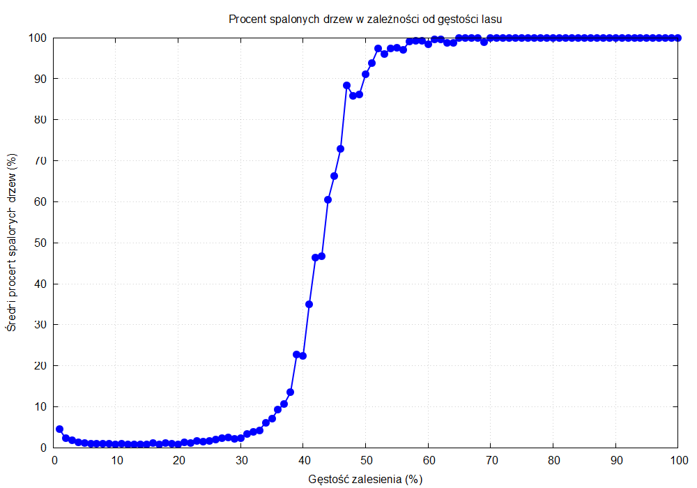
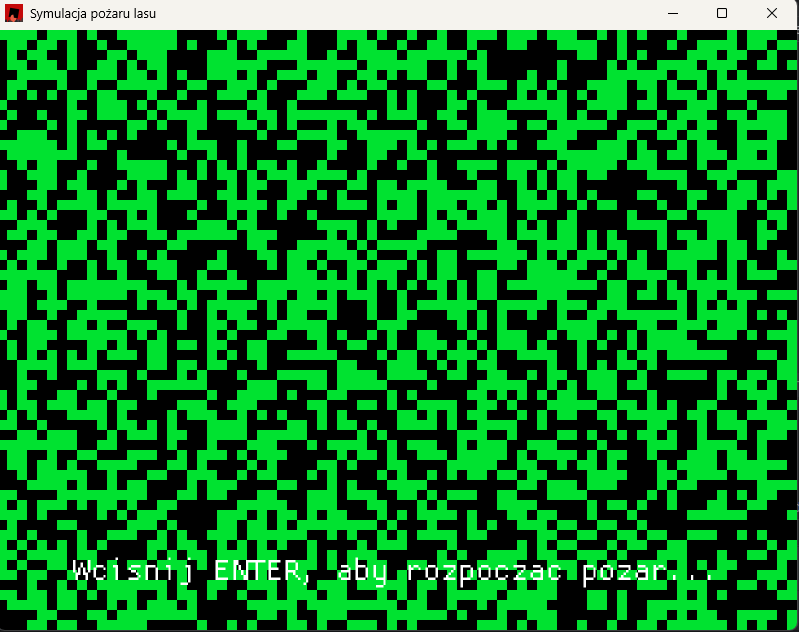
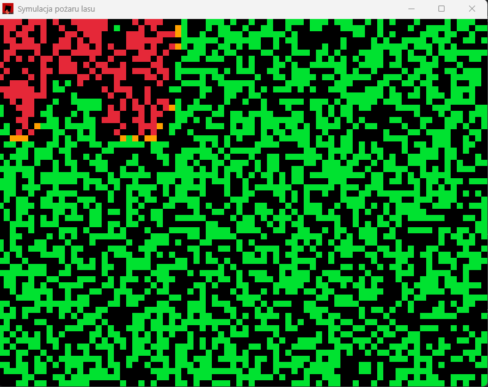
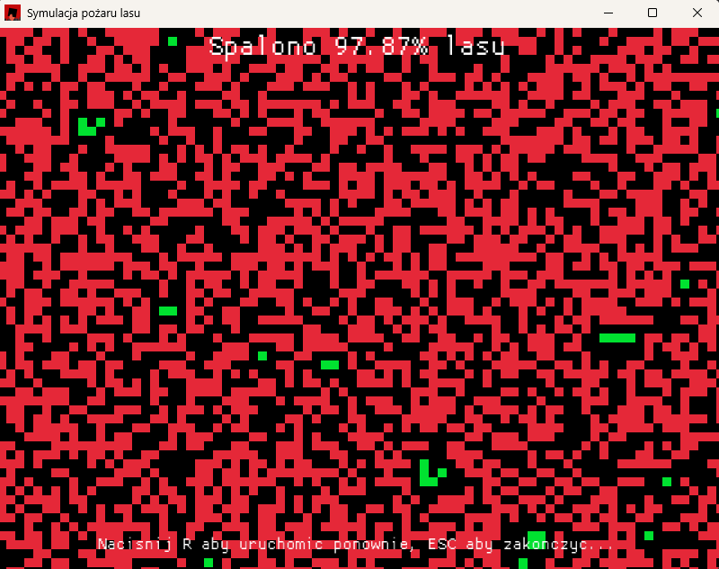

# Forest Fire Simulation 🌲🔥

A Rust-based forest fire simulation program that analyzes optimal forest density to minimize fire damage risk. The simulation models lightning-induced forest fires and determines the best compromise between tree density and fire risk.

## 🎯 Project Goal

The program solves an optimization problem: finding the optimal forest density that provides the best balance between maximizing tree coverage and minimizing fire damage risk. Through statistical analysis of multiple fire simulations, it identifies the forest density that maximizes tree count while keeping fire spread manageable.

## 🏗️ Core Features

### Forest Simulation
- **Grid-based model**: Rectangular forest grid with customizable dimensions
- **Deterministic tree placement**: Fixed number of trees for given density, but random positioning
- **Fire propagation**: Fire spreads to all 8 neighboring cells (including diagonals)
- **Statistical analysis**: 100+ simulations per density level for stable results

### Visualization
- **Real-time rendering**: Interactive visualization using Macroquad framework
- **Color-coded states**: 
  - **Black**: Empty space
  - **Green**: Healthy trees
  - **Orange**: Burning trees  
  - **Red**: Burned trees

### Performance Optimization
- **Multi-threading**: Parallel execution of simulations using `std::thread`
- **Efficient data structures**: Optimized grid representation
- **CSV output**: Detailed results export for further analysis

## 🚀 Usage

### Basic Simulation
```bash
# Run simulation with 50x50 grid and 25.13% forest density
./forest -x 50 -y 50 -p 25.13
```

### Full Analysis
```bash
# Analyze all densities from 1% to 100%
./forest --analyze
```

### Command Line Options
- `-x <width>`: Grid width (default: 50)
- `-y <height>`: Grid height (default: 50)
- `-p <percentage>`: Forest density percentage (e.g., 25.13 for 25.13%)
- `--analyze`: Run comprehensive analysis across all density levels

## 📊 Key Findings

Based on extensive simulations on 50x50 grids:

- **Optimal Density**: ~30-33% forest coverage
- **Critical Threshold**: Above 40-50% density, fire damage increases dramatically
- **Risk Assessment**: Below 30% density, fires remain localized; above 40%, fires can consume nearly 100% of trees


*Forest density vs. percentage of burned trees - showing critical threshold around 40% and optimal density below 33%*

### Performance Characteristics
- **Low Density (1-20%)**: Very fast simulations, minimal fire spread
- **Medium Density (20-35%)**: Moderate simulation time, controlled fire spread
- **High Density (35%+)**: Longer simulation time due to extensive fire propagation

## 🏛️ Architecture

### Core Modules

#### `forest` Module
- `Cell` enum: Represents cell states (Empty, Tree, Burning, Burned)
- `Forest` struct: Main forest grid with fire simulation logic
- Key methods:
  - `grow(percentage)`: Plants trees according to density
  - `start_fire()`: Ignites random tree
  - `spread_fire()`: Propagates fire to neighbors
  - `burned_percentage()`: Calculates damage statistics

#### `point` Module
- `Point` struct: 2D coordinate representation
- `neighbors()`: Returns all 8 adjacent coordinates within bounds
- Optimized for efficient neighbor calculation

#### `analyze` Module
- Runs comprehensive multi-density analysis
- Generates individual CSV files per density level
- Creates summary statistics across all simulations
- Implements parallel processing for performance

## 📈 Output Files

The program generates detailed CSV reports:
- `results_<density>.csv`: Individual simulation results for each density
- `results.csv`: Summary statistics with averaged results
- Ready for plotting and statistical analysis

## 🔧 Technical Implementation

### Multi-threading Architecture
```rust
// Parallel simulation execution
let handles: Vec<_> = (0..num_threads).map(|thread_id| {
    thread::spawn(move || {
        // Run simulations in parallel
        simulate_batch(thread_id, simulations_per_thread)
    })
}).collect();
```


### Memory Efficiency
- Grid-based storage optimized for cache locality
- Minimal memory allocation during simulation loops
- Efficient state transitions using enum representations

## 🎮 Visualization Features

Interactive real-time visualization showing:
- Forest growth patterns
- Fire initiation and spread
- Burn progression over time
- Final damage assessment

### Simulation States



*Initial forest state - green trees randomly distributed across the grid*

 

*Fire spreading through the forest - orange flames consuming trees*



*Post-fire state - red burned areas with remaining green trees*

The visualization clearly demonstrates how fire spreads differently based on forest density and tree distribution patterns.

## 🔮 Future Improvements

### Scalability Enhancements
- **Tiled Processing**: Divide large grids into manageable chunks
- **Dynamic Loading**: Stream grid sections to handle massive forests
- **GPU Acceleration**: Leverage parallel processing for fire propagation

### Advanced Features
- **Weather Simulation**: Wind effects on fire spread direction
- **Terrain Modeling**: Elevation and moisture content factors
- **Species Diversity**: Different tree types with varying fire resistance
- **Firebreaks**: Strategic empty zones to contain fires

## 🛠️ Dependencies

- **Rust**: Core language (edition 2021+)
- **Macroquad**: Graphics and visualization
- **Standard Library**: Threading and file I/O
- **CSV**: Data export functionality

## 📋 Requirements

- Rust 1.70+ 
- Sufficient RAM for grid storage (scales with grid size²)
- Multi-core CPU recommended for parallel analysis

## 🤝 Contributing

This project was developed as part of academic research into forest fire optimization. Contributions welcome for:
- Performance improvements
- Additional visualization features  
- Extended analysis parameters
- Cross-platform compatibility

---

*Developed by Łukasz Cichy (Index: 286471) as part of Rust programming coursework.*
